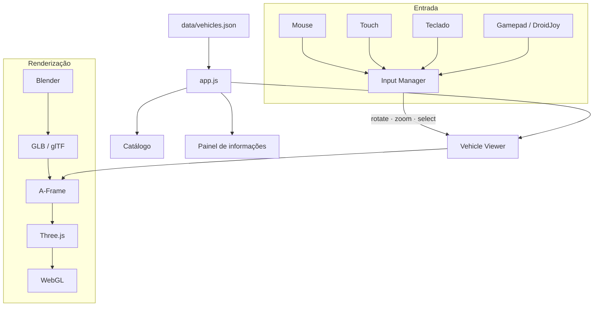

# Vehicle 3D Showroom

[](https://github.com/lianeheidemann/showroom-3d/actions/workflows/pages.yml)
[](https://lianeheidemann.github.io/showroom-3d/)
[](LICENSE)


**🔗 Demo:** https://lianeheidemann.github.io/showroom-3d/

## Sobre

Aplicação web interativa para visualização tridimensional de veículos, permitindo navegar pelo catálogo, explorar modelos 3D e consultar informações dos veículos.

É um MVP 100% estático, sem backend, pensado para publicação no GitHub Pages e para evoluir por fases (veja [docs/future-implementations.md](docs/future-implementations.md)).

> Os veículos, preços e dados do catálogo são **fictícios**, apenas para demonstração.

## Tecnologias

- HTML5, CSS3 e JavaScript puro (módulos ES, sem framework nem etapa de build)
- [A-Frame](https://aframe.io/) 1.7: cena, câmera, luzes e carregamento de GLB
- [Three.js](https://threejs.org/), o que vem embutido no A-Frame (`AFRAME.THREE`), usado para órbita, enquadramento, raycasting e liberação de memória
- WebGL
- Gamepad API do navegador (compatível com Xbox/XInput e DroidJoy)
- Blender para modelagem e exportação
- GLB / glTF 2.0

## Arquitetura



Existe um único renderer (o do A-Frame). O Input Manager traduz todas as entradas em três ações (`rotate`, `zoom` e `select`), e o viewer só conhece essas ações. Mais detalhes em [docs/architecture.md](docs/architecture.md).

## Estrutura

```text
index.html               layout e cena A-Frame
css/main.css             tema dark e layout responsivo
js/app.js                inicialização, carregamento do JSON e estados de erro
js/catalog.js            lista de veículos
js/vehicle-info.js       painel de informações
js/gallery.js            miniaturas de vistas
js/viewer.js             visualizador 3D (carregar/descartar modelo, órbita, zoom, raycast)
js/placeholder-car.js    carro provisório enquanto não houver GLB
js/input-manager.js      normalização das entradas
js/mouse-input.js        mouse e scroll
js/touch-input.js        arrastar e pinça
js/keyboard-input.js     setas e + / -
js/gamepad-input.js      Gamepad API
js/format.js, toast.js   utilitários
data/vehicles.json       catálogo (único lugar com dados dos veículos)
assets/models/           GLBs exportados do Blender
assets/images/           thumbnails e miniaturas
docs/                    arquitetura, exportação Blender e próximas fases
```

## Controles

| Entrada | Ação |
|---|---|
| Mouse: arrastar | Gira o veículo (horizontal) e ajusta levemente o ângulo (vertical) |
| Mouse: scroll | Zoom, com distância mínima e máxima |
| Mouse: clique no veículo | Raycast no modelo e destaque do painel de informações |
| Touch: um dedo | Gira |
| Touch: pinça | Zoom |
| Touch: toque no veículo | Destaque do painel |
| Teclado: ← → ↑ ↓ | Gira / ângulo vertical |
| Teclado: `+` `-` | Zoom |
| Gamepad: analógico esquerdo X / Y | Gira / ângulo vertical |
| Gamepad: RT / LT | Aproxima / afasta |

O gamepad é opcional: sem controle ou sem suporte à Gamepad API, a aplicação funciona normalmente e só indica o status na barra inferior.

### DroidJoy

O site não tem nenhuma integração específica com o DroidJoy. O DroidJoy Server cria um controle XInput virtual no Windows, e o navegador o expõe pela Gamepad API como qualquer controle Xbox:

```text
Android → DroidJoy → DroidJoy Server → XInput → Windows → Navegador → Gamepad API → gamepad-input.js
```

No Chrome e no Edge, o controle só aparece depois que você pressionar algum botão com a página em foco.

## Como executar

Como o catálogo é carregado com `fetch()`, **não abra o `index.html` direto pelo explorador de arquivos** (`file://`): o navegador bloqueia a requisição e a página mostra uma mensagem de erro. Use qualquer servidor estático:

```bash
python -m http.server 8000
```

Depois acesse:

```text
http://localhost:8000
```

Alternativas: `npx serve`, ou a extensão *Live Server* do VS Code.

## GitHub Pages

O deploy é automático pelo workflow [.github/workflows/pages.yml](.github/workflows/pages.yml). A cada push na `main`, ele:

1. valida o `data/vehicles.json`;
2. monta o site só com os arquivos publicados (`index.html`, `css/`, `js/`, `data/`, `assets/`);
3. publica no GitHub Pages.

O workflow também pode ser disparado manualmente em **Actions → Deploy GitHub Pages → Run workflow**.

**Configuração única:** em **Settings → Pages → Build and deployment**, selecione **Source: GitHub Actions**. No plano gratuito do GitHub, o Pages exige repositório público.

Site publicado: https://lianeheidemann.github.io/showroom-3d/

Todos os caminhos do projeto são relativos, então o site funciona dentro do subdiretório do repositório.

## Como substituir os modelos provisórios

Enquanto `assets/models/<carro>.glb` não existir, o viewer mostra um carro provisório montado com primitivas, com um aviso "Modelo provisório". Para usar o modelo real:

1. Exporte o veículo do Blender como `.glb` (passo a passo em [docs/blender-export.md](docs/blender-export.md)).
2. Salve com o nome indicado em `model3d` no `data/vehicles.json` (ex.: `assets/models/corolla.glb`).
3. Recarregue a página. O arquivo é detectado automaticamente e o aviso desaparece.

Para trocar as thumbnails, gere uma imagem 16:9 (por exemplo um render do Blender em `.webp`), coloque em `assets/images/` e atualize `thumbnail` no JSON. As miniaturas de vistas ficam em `gallery`.

### Adicionar um veículo

Acrescente um objeto em `data/vehicles.json` com os mesmos campos (`id`, `brand`, `model`, `version`, `year`, `mileage`, `engine`, `transmission`, `color`, `colorHex`, `body`, `fuel`, `price`, `model3d`, `thumbnail`, `gallery`). Nenhum código precisa ser alterado.

## Desempenho

- Ao abrir a página, só as thumbnails são carregadas.
- O GLB só é baixado quando o veículo é selecionado.
- Ao trocar de veículo, o modelo anterior sai da cena e suas geometrias, materiais e texturas são liberados da GPU. Só um modelo fica ativo por vez.

## Licença

[MIT](LICENSE)
