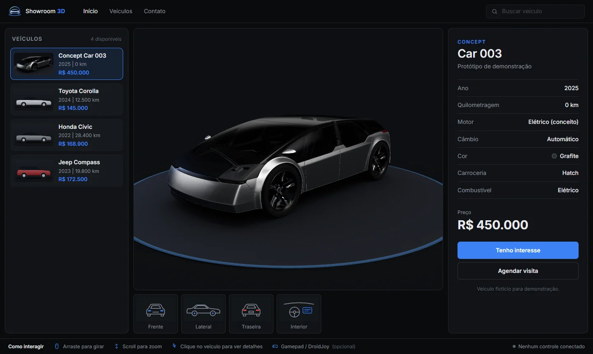

<div align="center">


# Vehicle 3D Showroom

**Showroom automotivo 3D para a web: explore, gire e aproxime veículos direto no navegador.**

[](https://lianeheidemann.github.io/showroom-3d/)
[](https://github.com/lianeheidemann/showroom-3d/actions/workflows/pages.yml)
[](LICENSE)




</div>

## Sobre

Catálogo de veículos com visualizador 3D interativo: o cliente escolhe um carro, gira, aproxima e consulta ficha técnica e preço. É um site **100% estático**, sem backend nem build, publicado no GitHub Pages.

- Modelos **GLB/glTF** carregados sob demanda, com enquadramento automático e iluminação de estúdio
- Vistas **Frente / Lateral / Traseira**, zoom com limites e clique no veículo
- Mouse, touch, teclado e **gamepad** (via InputMapper)
- Catálogo em um único [`data/vehicles.json`](data/vehicles.json)

> [!NOTE]
> Veículos, preços e dados são **fictícios**, apenas para demonstração.

## Executar

```bash
git clone https://github.com/lianeheidemann/showroom-3d.git
cd showroom-3d
python -m http.server 8000
```

Acesse **http://localhost:8000**. Não abra o `index.html` direto pelo arquivo (`file://`), porque o navegador bloqueia o carregamento do catálogo.

O deploy é automático: cada push na `main` publica no [GitHub Pages](https://lianeheidemann.github.io/showroom-3d/).

## Controles

| Ação | Mouse | Touch | Teclado | Gamepad |
|---|---|---|---|---|
| Girar | Arrastar | Um dedo | `←` `→` | Setas `←` `→` ou analógico esquerdo |
| Ângulo vertical | Arrastar na vertical | Um dedo | `↑` `↓` | Analógico esquerdo |
| Zoom | Scroll | Pinça | `+` `-` | RT / LT |
| Detalhes | Clique no carro | Toque no carro | — | — |

**InputMapper:** ative a emulação de *Xbox 360 Controller* e pressione um botão com a página em foco para o navegador reconhecer o controle.

## Estrutura

```text
index.html · css/ · data/vehicles.json · assets/ (models, images, icon)
js/
├── app.js     # compõe os módulos
├── data/      # leitura do catálogo
├── input/     # mouse, touch, teclado, gamepad → Input Manager
├── viewer/    # cena 3D: carga, órbita, enquadramento, iluminação
├── ui/        # catálogo, ficha, vistas, avisos
└── utils/     # formatação
```

## Documentação

| Documento | Conteúdo |
|---|---|
| [Arquitetura](docs/architecture.md) | Módulos, dependências e decisões técnicas |
| [Guia de modelos 3D](docs/3d-models-guide.md) | Como tratar, salvar e publicar modelos no Blender |
| [Exportação Blender](docs/blender-export.md) | Opções da exportação GLB |
| [Roadmap](docs/future-implementations.md) | Próximas fases |

## Créditos e licença

- **Concept Car 003:** [FREE Concept Car 003 (CC0)](https://sketchfab.com/3d-models/free-concept-car-003-public-domain-cc0-77664fc474c444f4947e9834ed0d30ad), de [Unity Fan](https://sketchfab.com/unityfan777), no Sketchfab.
- Código sob a licença [MIT](LICENSE). Modelos de terceiros seguem suas próprias licenças.
