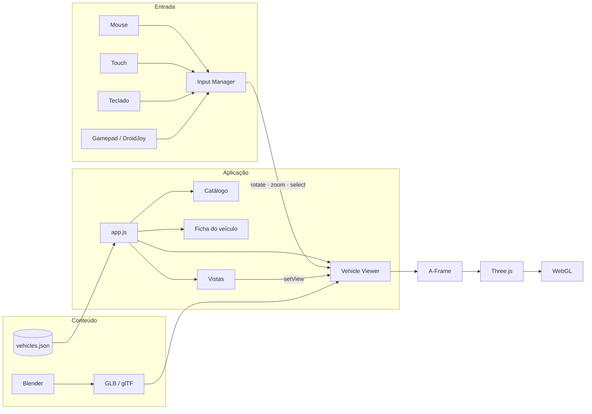

<div align="center">


# Vehicle 3D Showroom

**Showroom automotivo 3D para a web: explore, gire e aproxime veículos direto no navegador.**

[](https://lianeheidemann.github.io/showroom-3d/)
[](https://github.com/lianeheidemann/showroom-3d/actions/workflows/pages.yml)
[](LICENSE)


[**Demo**](https://lianeheidemann.github.io/showroom-3d/) ·
[**Arquitetura**](docs/architecture.md) ·
[**Pipeline Blender**](docs/blender-export.md) ·
[**Roadmap**](docs/future-implementations.md)

<br>


</div>

<br>

## Sumário

- [Visão geral](#visão-geral)
- [Funcionalidades](#funcionalidades)
- [Stack](#stack)
- [Arquitetura](#arquitetura)
- [Começando](#começando)
- [Controles](#controles)
- [Estrutura do projeto](#estrutura-do-projeto)
- [Catálogo e modelos 3D](#catálogo-e-modelos-3d)
- [Deploy](#deploy)
- [Desempenho e robustez](#desempenho-e-robustez)
- [Roadmap](#roadmap)
- [Créditos](#créditos)
- [Licença](#licença)

## Visão geral

O **Vehicle 3D Showroom** é uma aplicação web para vender veículos de um jeito mais visual. O cliente navega pelo catálogo, escolhe um carro, interage com o modelo 3D e consulta a ficha técnica e o preço.

O projeto é **100% estático**: sem backend, sem banco de dados e sem etapa de build. Roda em qualquer hospedagem estática e está publicado no GitHub Pages. A arquitetura foi pensada para crescer por fases, de hotspots e animações até AR e VR.

> [!NOTE]
> Os veículos, preços e dados do catálogo são **fictícios**, apenas para demonstração.

## Funcionalidades

| | |
|---|---|
| 🚗 **Catálogo dinâmico** | Veículos lidos de um único `data/vehicles.json`; adicionar um carro não exige mudar código |
| 🧊 **Visualizador 3D** | Modelos GLB/glTF com enquadramento automático, plataforma e iluminação de estúdio com reflexos |
| 🖱️ **Interação completa** | Girar, zoom com limites, clique no veículo (raycasting) e vistas Frente / Lateral / Traseira com transição suave |
| 📱 **Mobile** | Layout responsivo, arrastar com um dedo e pinça para zoom |
| 🎮 **Gamepad** | Gamepad API: controles Xbox/XInput e DroidJoy funcionam sem integração específica |
| ⚡ **Carregamento sob demanda** | Só o modelo selecionado é baixado; o anterior é liberado da GPU |
| 🛡️ **Tolerante a falhas** | Modelo provisório enquanto o GLB não existe, mensagens amigáveis e correção automática de modelos problemáticos |

## Stack

| Camada | Tecnologia |
|---|---|
| Interface | HTML5, CSS3 e JavaScript puro (módulos ES) |
| Cena 3D | [A-Frame 1.7](https://aframe.io/): cena, câmera, luzes e carregamento de GLB |
| Renderização | [Three.js](https://threejs.org/) embutido no A-Frame (`AFRAME.THREE`) sobre WebGL, com um único renderer |
| Entrada | Pointer/Touch Events, teclado e Gamepad API |
| Conteúdo 3D | Blender → GLB / glTF 2.0 |
| Deploy | GitHub Actions → GitHub Pages |

## Arquitetura



- **Um único renderer:** o A-Frame gerencia a cena, e o Three.js dele é usado só onde é preciso (órbita, raycasting, enquadramento e liberação de memória).
- **Entradas desacopladas:** mouse, touch, teclado e gamepad são convertidos pelo `InputManager` em três ações (`rotate`, `zoom` e `select`). O viewer não sabe de onde veio a entrada.
- **Dados separados da interface:** todo o conteúdo vem do JSON e dos assets.

Detalhes em [docs/architecture.md](docs/architecture.md).

## Começando

**Pré-requisito:** um navegador moderno com WebGL e qualquer servidor HTTP estático. O exemplo abaixo usa Python.

```bash
git clone https://github.com/lianeheidemann/showroom-3d.git
cd showroom-3d
python -m http.server 8000
```

Acesse **http://localhost:8000**.

> [!IMPORTANT]
> Não abra o `index.html` direto pelo explorador de arquivos (`file://`). O catálogo é carregado com `fetch()`, que o navegador bloqueia nesse modo. Alternativas ao Python: `npx serve` ou a extensão *Live Server* do VS Code.

## Controles

| Ação | Mouse | Touch | Teclado | Gamepad |
|---|---|---|---|---|
| Girar o veículo | Arrastar | Arrastar com um dedo | `←` `→` | Setas `←` `→` (D-pad) ou analógico esquerdo X |
| Ângulo vertical | Arrastar na vertical | Arrastar na vertical | `↑` `↓` | Analógico esquerdo Y |
| Zoom | Scroll | Pinça | `+` `-` | RT (aproxima) / LT (afasta) |
| Ver detalhes | Clique no veículo | Toque no veículo | — | — |
| Vistas predefinidas | Miniaturas Frente / Lateral / Traseira | Toque nas miniaturas | — | — |

O zoom tem limites: a câmera não entra no carro nem se afasta demais. O gamepad é opcional, e sem ele a aplicação funciona normalmente.

<details>
<summary><b>Controles via InputMapper ou DroidJoy</b></summary>

<br>

Não há integração proprietária. Esses programas expõem um controle XInput (Xbox 360) no Windows, e o navegador o lê pela Gamepad API como qualquer controle Xbox:

```text
DualShock / DualSense → InputMapper ─┐
Android → DroidJoy → DroidJoy Server ┴→ XInput → Windows → Navegador → Gamepad API → gamepad-input.js
```

No InputMapper, mantenha a emulação de **Xbox 360 Controller** ativa, para que o navegador use o mapeamento padrão (setas = botões 14 e 15).

No Chrome e no Edge, o controle só é reconhecido depois que um botão é pressionado com a página em foco. O status aparece no canto inferior direito.

</details>

## Estrutura do projeto

```text
showroom-3d/
├── index.html                 # Layout e cena A-Frame
├── css/main.css               # Tema dark e layout responsivo
├── js/
│   ├── app.js                 # Inicialização, carregamento do catálogo e estados de erro
│   ├── viewer.js              # Visualizador: carga/descarte, enquadramento, órbita, vistas, raycast
│   ├── placeholder-car.js     # Carro provisório enquanto o GLB não existe
│   ├── catalog.js             # Lista de veículos
│   ├── vehicle-info.js        # Ficha técnica e preço
│   ├── gallery.js             # Miniaturas de vistas
│   ├── input-manager.js       # Normalização das entradas
│   ├── mouse-input.js · touch-input.js · keyboard-input.js · gamepad-input.js
│   └── format.js · toast.js   # Utilitários
├── data/vehicles.json         # Catálogo, único lugar com dados dos veículos
├── assets/
│   ├── models/                # GLBs
│   ├── images/                # Thumbnails e miniaturas
│   └── icon/                  # Logo e favicons
├── docs/                      # Arquitetura, pipeline Blender e roadmap
└── .github/workflows/pages.yml
```

## Catálogo e modelos 3D

### Adicionar um veículo

Acrescente um item em `data/vehicles.json`:

```json
{
  "id": "corolla-2024",
  "brand": "Toyota",
  "model": "Corolla",
  "version": "XEI 2.0 Flex Automático",
  "year": 2024,
  "mileage": 12500,
  "engine": "2.0 Flex",
  "transmission": "Automático CVT",
  "color": "Prata",
  "colorHex": "#b9bec5",
  "body": "Sedã",
  "fuel": "Flex",
  "price": 145000,
  "model3d": "assets/models/corolla.glb",
  "thumbnail": "assets/images/corolla.svg",
  "gallery": [
    { "label": "Frente", "view": "front", "image": "assets/images/views/front.svg" }
  ]
}
```

A ordem no JSON é a ordem do catálogo, e o primeiro item abre selecionado.

### Modelos provisórios e GLBs reais

Enquanto o arquivo de `model3d` não existir, o viewer exibe um **carro provisório** gerado com primitivas e um aviso discreto. Para usar o modelo real, exporte do Blender como `.glb` e salve no caminho indicado. Ele é detectado automaticamente, sem mudar código.

O guia [docs/blender-export.md](docs/blender-export.md) cobre escala, orientação, nomes de peças, orçamento de polígonos e os problemas mais comuns em modelos baixados da internet.

## Deploy

O deploy é contínuo via [GitHub Actions](.github/workflows/pages.yml). A cada push na `main`:

1. **Valida** o `data/vehicles.json`;
2. **Monta** o site só com os arquivos publicados (`index.html`, `css/`, `js/`, `data/`, `assets/`);
3. **Publica** no GitHub Pages: **https://lianeheidemann.github.io/showroom-3d/**

Para um fork: em **Settings → Pages**, selecione **Source: GitHub Actions**. Todos os caminhos são relativos, então o site funciona em qualquer subdiretório.

## Desempenho e robustez

- **Sob demanda:** ao abrir a página, só as thumbnails são carregadas. Cada GLB é baixado apenas quando o veículo é selecionado.
- **Um modelo por vez:** ao trocar de veículo, geometrias, materiais e texturas do anterior são liberados da GPU. Cargas antigas que terminem fora de ordem são descartadas.
- **Modelos imperfeitos:** peças soltas longe do carro e planos de sombra (comuns em exportações do Sketchfab) são detectados e ocultados. Modelos em escala errada, como centímetros, são corrigidos.
- **Falhas tratadas:** JSON ausente, GLB inexistente ou corrompido, navegador sem Gamepad API e ausência de controle geram mensagens amigáveis na interface. Os detalhes técnicos vão para o console.

## Roadmap

| Fase | Entrega | Status |
|---|---|---|
| 1 | MVP: catálogo, viewer 3D, mouse, touch, teclado e gamepad | ✅ |
| 6 | Câmeras predefinidas (Frente, Lateral, Traseira) | 🟡 Parcial |
| 2–5 | Hotspots, peças individuais, animações e modo interior | ⏳ |
| 7–12 | Troca de cor, gamepad avançado, busca e filtros, comparação, favoritos e links por veículo | ⏳ |
| 13–15 | Contato, agendamento e painel administrativo (exigem backend) | ⏳ |
| 16–19 | CDN para modelos, compressão (Draco/KTX2), AR e VR | ⏳ |

Plano completo em [docs/future-implementations.md](docs/future-implementations.md).

## Créditos

- **Concept Car 003:** [FREE Concept Car 003 — public domain (CC0)](https://sketchfab.com/3d-models/free-concept-car-003-public-domain-cc0-77664fc474c444f4947e9834ed0d30ad), de [Unity Fan](https://sketchfab.com/unityfan777), no Sketchfab.
- Construído com [A-Frame](https://aframe.io/) e [Three.js](https://threejs.org/).

## Licença

Código distribuído sob a licença [MIT](LICENSE). Modelos 3D de terceiros seguem as licenças indicadas em [Créditos](#créditos).
